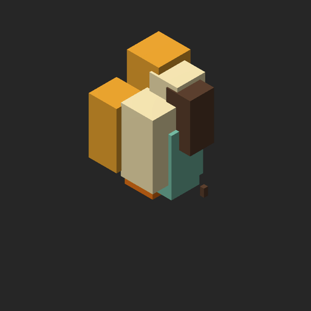
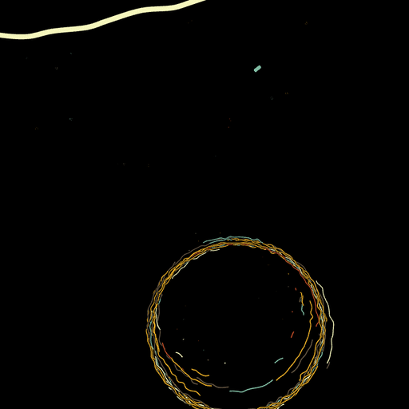

# About

-   An attempt to create a new, clean and light repo of my latest artworks built with `canvas-sketch`.

# Contents

-   [Tools](#org76d6ac4)
-   [Overview](#org7798efb)

# Tools

<table border="2" cellspacing="0" cellpadding="6" rules="groups" frame="hsides">

<colgroup>
<col  class="org-left" />

<col  class="org-left" />
</colgroup>
<thead>
<tr>
<th scope="col" class="org-left">Tool</th>
<th scope="col" class="org-left">Documentation</th>
</tr>
</thead>

<tbody>
<tr>
<td class="org-left"><b>canvas-sketch</b></td>
<td class="org-left"><a href="https://github.com/mattdesl/canvas-sketch/blob/master/docs/README.md">API Docs</a></td>
</tr>
</tbody>

<tbody>
<tr>
<td class="org-left"><b>p5.js</b></td>
<td class="org-left"><a href="https://p5js.org/reference/">API Docs</a></td>
</tr>
</tbody>

<tbody>
<tr>
<td class="org-left"><b>three.js</b></td>
<td class="org-left"><a href="https://threejs.org/docs/">API Docs</a></td>
</tr>
</tbody>
</table>

# Overview

<table border="2" cellspacing="0" cellpadding="6" rules="groups" frame="hsides">

<colgroup>
<col  class="org-left" />

<col  class="org-left" />

<col  class="org-left" />
</colgroup>
<thead>
<tr>
<th scope="col" class="org-left">Example Screenshots</th>
<th scope="col" class="org-left">( small selection )</th>
<th scope="col" class="org-left">&#xa0;</th>
</tr>
</thead>

<tbody>
<tr>
<td class="org-left"></td>
<td class="org-left"></td>
<td class="org-left"></td>
</tr>
</tbody>

<tbody>
<tr>
<td class="org-left"></td>
<td class="org-left"></td>
<td class="org-left"></td>
</tr>
</tbody>

<tbody>
<tr>
<td class="org-left"></td>
<td class="org-left"></td>
<td class="org-left"></td>
</tr>
</tbody>
</table>

